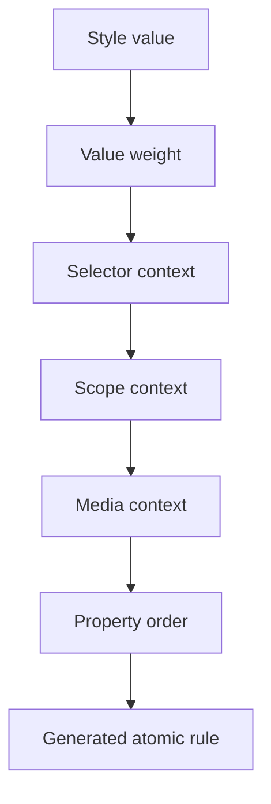
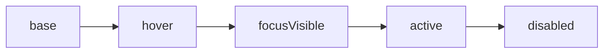
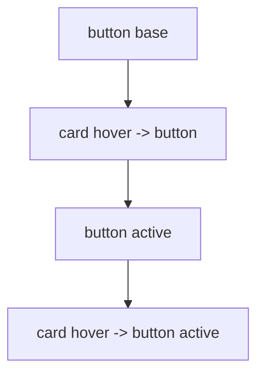
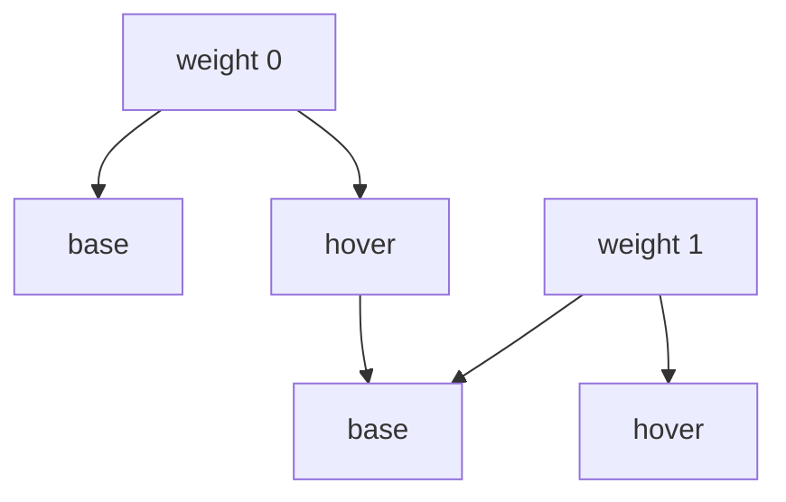

Priority answers one question:

When two generated rules target the same property on the same element, which one
should win?

Fluentic does not treat priority as one large number.

It treats priority as a path through a few ordered buckets.



Lower paths are emitted earlier.

Higher paths are emitted later.

Later generated CSS wins through the normal CSS cascade.

## The Path

A single declaration becomes an atomic rule.

```ts
const button = style({
  color: 'black',
}).hover({
  color: 'blue',
});
```

Fluentic does not only see two `color` values.

It sees two paths:

```txt
weight 0 -> base selector -> no scope -> no media -> color
weight 0 -> hover selector -> no scope -> no media -> color
```

The hover path is later than the base path, so hover wins while the element is
hovered.

## Bucket Order

The practical model is:

```txt
value weight
  selector context
    scope context
      media context
        property order
```

Each level is only compared inside the level above it.

That is the part that matters most.

A media rule does not jump above a selector rule just because it appears later
in source code.

A scoped parent hover rule does not automatically beat a direct active rule on
the target.

The declaration wins when its whole path is later.

## Selector Context

Selectors describe the state of the element that owns the class.

Common direct selectors are hover, focus visible, active, disabled, and custom
selectors created with `selector(...)`.

```ts
const button = style({
  color: 'black',
}).hover({
  color: 'blue',
}).active({
  color: 'red',
});
```

The default builder orders common states from lower to higher priority:

```txt
link -> visited -> hover -> focusWithin -> focus -> focusVisible -> active -> disabled
```

So if a hovered button is also active, the active color wins.



Design systems can define their own selector order with
`selectorPriority(...)`.

```ts
import { selector, selectorPriority } from '@fluentic/style/selector';

const selectors = {
  hover: selector(':hover'),
  focusVisible: selector(':focus-visible'),
  pressed: selector('[aria-pressed="true"]'),
  disabled: selector(':disabled'),
};

const prioritySelectors = selectorPriority(selectors, [
  'hover',
  'focusVisible',
  'pressed',
  'disabled',
]);
```

The array goes from lower priority to higher priority.

## Scope Context

Scopes describe an outside condition.

For example, a card can change a button when the card is hovered.

```ts
const card = {
  root: style.slot({}),
  button: style.slot({
    color: 'black',
  }).active({
    color: 'red',
  }),
};

const cardHover = style.scope().hover([
  card.button({
    color: 'blue',
  }),
]);
```

This gives the button a parent-hover color.

It does not beat the button's direct active color.

```txt
base button color
parent hover button color
direct active button color
```

That is intentional.

The direct state of the button is usually more specific to the interaction than
the outside state of the parent.

If the parent-hover active state should win, write that exact context:

```ts
const cardHoverActive = style.scope().hover([
  card.button().active({
    color: 'purple',
  }),
]);
```

Now the path includes both the parent context and the direct active context.



The last path is the most specific interaction path.

## Media Context

Media is compared inside the current selector and scope context.

```ts
const button = style({
  color: 'black',
}).media('(max-width: 700px)', {
  color: 'blue',
}).hover({
  color: 'red',
});
```

At small widths, blue beats the base black.

While hovered, red still wins.

That is because the base media path is still a base selector path:

```txt
base color
base media color
hover color
```

If hover should change at the same breakpoint, put hover inside that media
context.

```ts
const button = style({
  color: 'black',
}).hover({
  color: 'red',
}).media(
  '(max-width: 700px)',
  style({
    color: 'blue',
  }).hover({
    color: 'purple',
  }),
);
```

Now there are two media paths:

```txt
base color
base media color
hover color
hover media color
```

The purple hover media color wins only when both conditions match.

## Property Order

Property order is the innermost level.

It keeps shorthand and longhand CSS predictable.

```ts
const box = style({
  margin: 4,
  marginTop: 8,
});
```

`marginTop` is emitted after `margin`, so the top edge can be refined without
manually splitting every side.

This bucket is intentionally small.

Property order should solve CSS shape problems, not component-state problems.

## Value Weight

Value weight is the outermost bucket.

```ts
const button = style({
  color: [1, '#111827'],
}).hover({
  color: '#2563eb',
});
```

The weighted base color can beat the unweighted hover color because it lives in
a higher value-weight bucket.



Use value weight sparingly.

It is for design-system rules that must intentionally sit above normal
composition.

Most app code should reach for composition order, selector order, or the right
scope context first.

## Reading Debug CSS

During development, `StyleDevUtils` can switch generated priority output.

```ts
StyleDevUtils.setPriorityMode.toLayer();
StyleDevUtils.setPriorityMode.toSort();
```

Layer mode makes the buckets easier to inspect.

Sort mode is closer to compact production output.

The priority model is the same either way.

The output format only changes how easy it is to read the generated CSS while
debugging.

For practical examples, see
[Priority And Rule Order](../beyond-the-basics/priority-and-rule-order).

For API details, see [Priority](../reference/priority).
